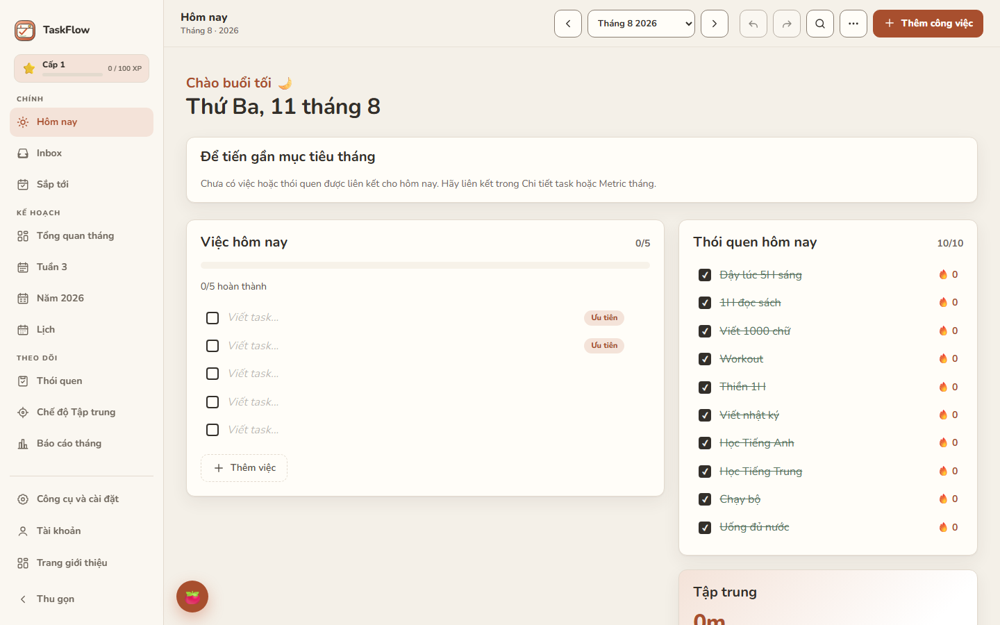
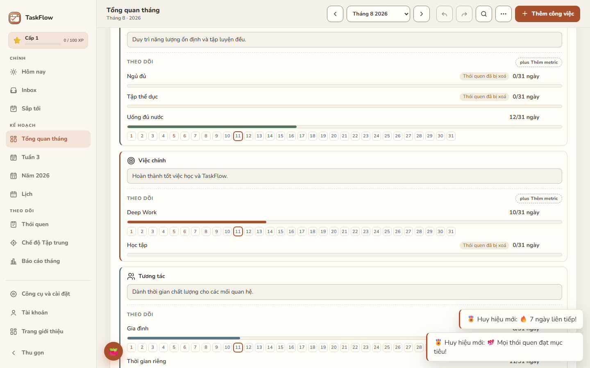
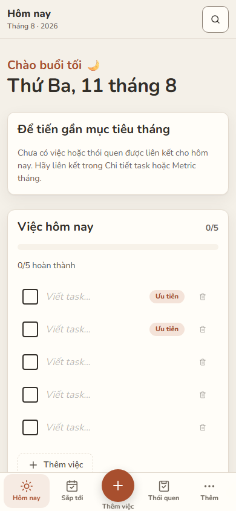
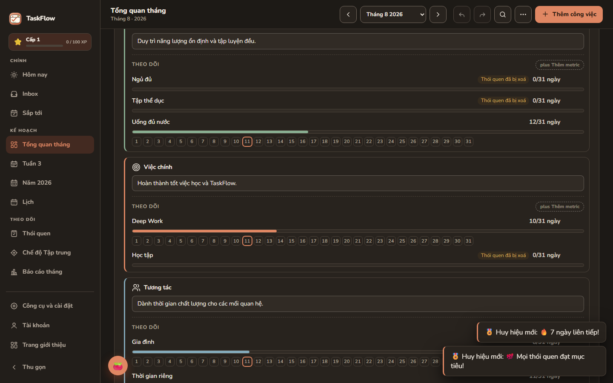

<div align="center">

#  TaskFlow

**Ứng dụng lập kế hoạch cá nhân miễn phí — Dự án & Mốc tiến độ · Time Blocking · Smart Planner · Thói quen linh hoạt · Insights · Focus/Pomodoro · Lịch · Báo cáo · AI Copilot tùy chọn**

**Calm Productivity** · **Offline-first** — dùng được không cần tài khoản, dữ liệu lưu trong trình duyệt (localStorage) · **Đồng bộ đám mây tùy chọn** khi đăng nhập · Hỗ trợ **tiếng Việt & tiếng Anh**

[](https://developer.mozilla.org/en-US/docs/Web/HTML)
[](https://developer.mozilla.org/en-US/docs/Web/CSS)
[](https://developer.mozilla.org/en-US/docs/Web/JavaScript)
[](https://developer.mozilla.org/en-US/docs/Learn)
[]()
[](LICENSE)

**🚀 [taskflow-todoist.vercel.app](https://taskflow-todoist.vercel.app/)**

</div>

**TaskFlow là hệ thống quản lý năng suất cá nhân offline-first** — một nơi duy nhất cho việc lập kế hoạch và điều hành hằng ngày.

> TaskFlow is an offline-first personal productivity system that connects long-term goals with weekly planning, daily tasks, habits and focused work.

---

## ✨ Tính năng chính (Core Features)

- 🗓️ **Today Dashboard** — việc cần làm hôm nay: task, tiến độ, thói quen, Focus, **Daily Alignment**
- 📥 **Inbox** — bắt nhanh mọi ý tưởng, lên lịch sau
- 🔭 **Upcoming** — nhìn trước công việc những ngày tới (hôm nay / sắp tới / quá hạn)
- ➕ **Quick Add** — thêm task nhanh từ mọi nơi (phím tắt, nút +)
- 📋 **Task Detail** — deadline · giờ · thời lượng · ưu tiên · lặp lại · tags · ghi chú · subtasks · nhắc việc · **liên kết mục tiêu**
- 📅 **Week planning** — 7 ngày, task + ghi chú + mục tiêu tuần + Pomodoro + **Weekly Review**
- 📊 **Month planning** — **Monthly Life Pillars** (Cơ thể · Việc chính · Tương tác), **Monthly Focus & Metrics**, habit tracker, reflection
- 🎯 **Year goals** — mục tiêu năm, biểu đồ quý/tháng, line chart 12 tháng
- 🗓️ **Calendar** — lịch task & focus theo ngày, **Tháng / Lịch trình (Schedule)**
- 📂 **Projects & Milestones** — biến mục tiêu lớn thành các mốc tiến độ rõ ràng, task gắn dự án/milestone
- ⏱️ **Time Blocking** — tạo time block cho task, phát hiện trùng lịch, bắt đầu Focus ngay từ block
- ⚡ **Energy & Context** — ước lượng thời lượng, năng lượng và ngữ cảnh cho từng task
- 🧠 **Smart Daily Planner** — planner quy tắc (không AI): chọn việc quan trọng, kiểm tra khối lượng, đề xuất time block — luôn xem trước rồi mới Áp dụng
- 🔁 **Habit tracking** — **lịch linh hoạt** (hằng ngày / chọn ngày trong tuần / X lần tuần / X lần tháng), streak 🔥, tỷ lệ hoàn thành, consistency, current/best run
- 💡 **Actionable Insights** — insight theo quy tắc từ dữ liệu thật của bạn (không phải AI), kèm hành động gợi ý
- ⚡ **Quick Capture** — chia sẻ ngoài / URL nhanh đưa thẳng vào Inbox, nhập liệu được sanitize
- 📅 **Google Calendar (tùy chọn)** — đọc lịch ngoài; xuất TimeBlock thành event Google — **push-only, không đồng bộ hai chiều**
- ✨ **AI Copilot (tùy chọn)** — đề xuất kế hoạch có cấu trúc, bạn xem trước rồi Áp dụng; AI không bao giờ tự sửa dữ liệu
- 🍅 **Focus / Pomodoro** — timer 25/5, thống kê phiên, chế độ tập trung
- 🪞 **Daily / Weekly / Monthly Reflection** — Quick & Deep Reflection, **Monthly Review**, carry-over tháng sau
- 📈 **Reports** — báo cáo tháng/tuần/năm, huy hiệu, cân bằng trụ cột, mood trend, chia sẻ ảnh 1080×1080
- 🔍 **Search** — tìm kiếm xuyên tháng (`Ctrl+K`)
- 📤 **Import / Export / Backup** — JSON · CSV · ICS, sao lưu tự động 7 bản
- 📲 **PWA** — cài như app thật, chạy offline-first
- ☁️ **Optional cloud sync** — đăng nhập để đồng bộ đa thiết bị
- 🌙 **Dark mode** + 4 chủ đề màu (kem · bạc hà · oải hương · đào)
- 🌐 **Tiếng Việt / English**

---

## 📸 Ảnh chụp màn hình

| Today — Desktop | Monthly Growth (Pillars + Metrics) |
|---|---|
|  |  |

| Today — Mobile | Dark Mode |
|---|---|
|  |  |

---

## 📖 Giới thiệu

**TaskFlow** là hệ thống năng suất cá nhân **offline-first** — *Calm Productivity*: một nơi duy nhất kết nối mục tiêu dài hạn với thực thi hằng ngày.

**Luồng sản phẩm chính (V2):**

```
Goal
  ↓
Project
  ↓
Milestone
  ↓
Task
  ↓
Smart Plan
  ↓
Time Block
  ↓
Focus
  ↓
Complete
  ↓
Reflect
  ↓
Insight
```

Cấu trúc kế hoạch: **Goal → Project → Milestone → Task → Time Block** — mục tiêu lớn được chia thành dự án và mốc tiến độ, rồi đưa vào lịch dưới dạng time block và thực thi bằng Focus.

> **Google Calendar ≠ đồng bộ hai chiều.** Kết nối là tùy chọn: đọc sự kiện để hiển thị, và *đẩy* TimeBlock thành event Google khi bạn bật (push-only, xóa event bị khóa sau cờ `syncDeletes` mặc định tắt). Không có engine kéo sửa đổi (pull-back).
>
> **AI Copilot ≠ chủ sở hữu trạng thái.** AI là tùy chọn, chỉ *đọc* context tối thiểu và trả về đề xuất; mọi thay đổi đi qua schema-validation → xem trước → bạn bấm Áp dụng → ghi bằng API TaskFlow chuẩn. AI không bao giờ trực tiếp sửa dữ liệu. Khi AI không khả dụng, planner quy tắc vẫn hoạt động.

Khi chưa đăng nhập, dữ liệu của bạn được lưu cục bộ trong trình duyệt — nội dung kế hoạch của bạn không được gửi lên máy chủ TaskFlow. Đăng nhập chỉ để bật **đồng bộ đám mây tùy chọn** (xem [Offline-first & Sync](#-offline-first--sync)).

---

## 📚 Chi tiết tính năng

### 📅 Tổng quan tháng
- Thẻ thông tin tháng/năm/tuần hiện tại + đồng hồ thời gian thực
- Biểu đồ tiến độ **6 tuần** dạng cột
- 🏛️ **Monthly Life Pillars** — 3 trụ cột mặc định (Cơ thể · Việc chính · Tương tác), mỗi trụ 1 **Monthly Focus** + metric có tiến độ **/ngày thật** (đúng day-count tháng)
- **Habit tracker 31 ngày** với cột sticky, ô tick + biểu đồ phần trăm từng thói quen (thêm/đổi tên/xoá)
- 🎯 **Mục tiêu habit tùy chỉnh** — mỗi thói quen có mục tiêu ngày riêng (mặc định 100%), phần trăm tính theo mục tiêu
- 🗓️ **Sao chép thói quen sang tháng sau** — giữ nguyên tên + mục tiêu, bảng tick tháng mới trống
- 🪞 **Daily Reflection** — Quick (mood + 2 ô) và Deep (5 câu, autosave)

### 📊 Báo cáo & Huy hiệu
- 📄 **Báo cáo tháng** — 1 cú nhấn: % mục tiêu, số ngày đạt, tổng streak 🔥, kỷ lục 🏆, điểm danh, thói quen đạt tốt nhất
- ⚖️ **Cân bằng trụ cột & mood trend** — tiến độ từng trụ cột (Cơ thể · Việc chính · Tương tác) trong báo cáo, kèm trend tâm trạng tự báo cáo theo tuần
- 📤 **Chia sẻ ảnh báo cáo** — tạo ảnh 1080×1080 (donut + thống kê), chia sẻ trực tiếp hoặc tải về `taskflow-report.png`
- 🏅 **Huy hiệu** — 🔥 7 ngày liên tiếp, 🔥🔥 30 ngày, 🏆 kỷ lục 14 ngày, 🎯 hoàn thành mọi mục tiêu, 💯 mọi thói quen đạt 100%, 📅 điểm danh 15 ngày — tự trao khi xem tháng hiện tại, lưu vĩnh viễn

### 🔥 Streak & Heatmap
- **Flame Hero** — chuỗi hiện tại 🔥, chuỗi kỷ lục 🏆, thanh tiến độ tới kỷ lục, thông báo "New record! 🎉"
- **Ember Ribbon 90 ngày** — heatmap kiểu GitHub xuyên 3 tháng, nhãn tháng, ô hôm nay viền đậm, tooltip đầy đủ tháng/ngày/%
- **Streak đa tháng** — đếm chuỗi ngày liên tiếp xuyên qua ranh giới tháng (dữ liệu đọc từ localStorage tháng trước)
- **Vệt 14 ngày** cho từng thói quen + % hoàn thành

### 🗓️ Kế hoạch năm
- 🧭 **Điều hướng nhiều năm** — nút «/» chuyển năm, tab "Năm YYYY" luôn đúng năm đang xem, lưới 12 tháng riêng cho từng năm
- Card tổng quan **năm + tháng hiện tại** kèm câu motto
- Biểu đồ cột **4 quý (Q1–Q4)** và **12 tháng**
- Panel **Mục tiêu năm** — donut, thống kê, nút **"Lấy dữ liệu từ 12 tháng từ Dashboard"** gộp mục tiêu toàn năm
- **Line chart tiến độ 12 tháng** + Reflection năm
- Bảng **Tổng quan theo quý** (donut + checklist từng quý)
- Lưới **12 tháng chi tiết**: bar tiến độ, checklist mục tiêu và ô ghi chú riêng từng tháng

### 📆 Kế hoạch tuần
- 6 tuần trong tháng, mỗi tuần một view riêng
- Grid **7 ngày** với task ưu tiên/thường, thanh tiến độ, ghi chú từng ngày
- Mục tiêu tuần + donut tiến độ + reflection tuần

### 🛠️ Tiện ích & Tuỳ chỉnh
- ⏱️ **Đồng hồ thời gian thực** — tự chuyển tuần/tháng khi qua ngày mới
- 📍 **Nút "Hôm nay"** — quay về tuần/tháng hiện tại ngay lập tức
- 🧭 **Điều hướng bàn phím** trên tab (mũi tên / Home / End)
- 🔄 **Nút "Quay lại tháng này"** khi bạn xem tháng khác
- 🎨 **4 chủ đề màu** + **Dark mode** lưu lựa chọn + toggle ngôn ngữ **VI/EN**
- ♿ Hỗ trợ **aria-label**, `role=checkbox`, điều hướng bằng Tab
- 📱 **Responsive** trên mobile, tablet và desktop

### 🔔 Nhắc việc habit/task
- Mỗi **thói quen** và **task** có thể bật nhắc riêng với giờ tự chọn (nút 🔔 cạnh tên) — khi đến giờ, trình duyệt hiện thông báo kèm tên mục cần làm
- Danh sách nhắc đang bật hiển thị ngay trong popup 🔔 của header, bật/tắt từng mục nhanh chóng
- Nhắc chính xác giờ hoạt động khi app đang mở (`setTimeout` tự lên lịch lại mỗi ngày); khi app đóng, nhắc hằng ngày dùng Periodic Background Sync (giới hạn của trình duyệt)

### 📊 Báo cáo tuần
- Nút **"📊 Báo cáo tuần"** trong view Tuần: % mục tiêu, số xong/đang làm/tổng, tỉ lệ habit theo 7 ngày, thói quen nổi bật 🔥, ngày năng suất nhất ⭐
- 📤 **Chia sẻ ảnh báo cáo tuần** — ảnh 1080×1080 (donut + thống kê + bar chart 7 ngày), chia sẻ trực tiếp hoặc tải `taskflow-week-report.png`

### 🍅 Widget Pomodoro trong tuần view
- Card **Pomodoro** ngay trong view Tuần: timer 25/5, start/pause/reset, chuyển nhanh chế độ Tập trung/Nghỉ
- **Thống kê session**: số phiên + tổng phút hôm nay và tuần này (key `planner-pomo-log`, tự đồng bộ đám mây)

### 📦 PWA — cài đặt như app thật
- 📲 **Cài đặt offline**: mở trang → chọn "Cài đặt ứng dụng" (Chrome/Edge) — app chạy ngoài cửa sổ trình duyệt, **hoạt động offline-first** (vẫn dùng được khi mất mạng)
- 🔔 **Nhắc việc hằng ngày**: bật nút 🔔 trong header, chọn giờ — trình duyệt nhắc điểm danh thói quen mỗi ngày (kể cả khi app đã đóng, nhờ Periodic Background Sync)
- 🔔 **Nhắc việc theo habit/task**: mỗi thói quen & task có giờ nhắc riêng (nút 🔔 cạnh tên) — chính xác khi app mở
- 🖼️ Icon pastel đầy đủ kích thước (192/512/maskable) cho Android & iOS

### 💾 Dữ liệu của bạn — sao lưu & in
- 📤 **Xuất JSON**: sao lưu toàn bộ 12 tháng + năm thành 1 file (khôi phục bất cứ lúc nào)
- 📥 **Nhập JSON**: khôi phục dữ liệu từ file sao lưu (ghi đè)
- 📊 **Xuất CSV**: mọi mục tiêu/thói quen/task/reflection thành bảng 7 section — dán thẳng vào **Google Sheets**
- 🖨️ **In / PDF**: in view đang mở (Tổng quan/Năm/Tuần) tối ưu A4 ngang, checkbox hiện ☐/☑, ẩn nút thao tác

### ↩️ Undo / Redo
- **Hoàn tác / Làm lại** mọi thao tác: tick task/habit/goal, thêm/xoá mục, sửa text, sắp xếp, thậm chí cả nút "Đặt lại"
- Nút ↩️/↪️ trong header + phím **`Ctrl+Z`** / **`Ctrl+Shift+Z`** — snapshot tối đa 50 bước trong phiên

### 🔀 Kéo-thả sắp xếp
- Kéo thả **task** trong ngày, **mục tiêu** trong tháng/tuần/năm, **thói quen** trong bảng để đổi thứ tự (lưu ngay, có undo)
- Gợi ý: kéo thả tốt nhất trên máy tính; trên mobile dùng thứ tự mặc định

### ⌨️ Phím tắt
- `Ctrl+K` — mở/đóng tìm kiếm xuyên tháng · `1-5` — chuyển view (Tổng quan/Tuần/Năm/Lịch) · `/` — focus ô thêm task hôm nay · `Esc` — đóng modal/chế độ tập trung

### 🕑 Sao lưu tự động
- App tự lưu **7 bản sao lưu** (`planner-backup-0..6`, vòng xoay) sau mỗi lần thay đổi — mở 💾 → **"Khôi phục bản sao lưu tự động"** để quay lại bản cũ bất kỳ
- Trước khi import JSON, app tự chốt 1 bản sao lưu dữ liệu hiện tại (an toàn không mất)

### 🎯 Chế độ Tập trung
- Nút 🎯 trong header: overlay tối giản chỉ còn **task hôm nay + thói quen cần làm** — tick ngay trong đó, `Esc` để thoát

### ✨ Thói quen mẫu & Demo
- Nút **✨ Thói quen mẫu** trong panel thói quen: 16 gợi ý (💧 📚 🏃 😴 …) thêm 1 chạm
- Nút **🎬 Demo** trong 💾: tạo sẵn 3 mục tiêu + 4 thói quen + 2 task hôm nay (dữ liệu đầy đủ để trải nghiệm ngay)

### 😊 Mood tracker
- **Chấm mood mỗi ngày** (😢→🤩) ngay trong view Tuần — nhiệt kế **heatmap cả tháng** ngay trên Tổng quan
- **Insight tự động**: ngày vui vs ngày buồn — hôm nào bạn hoàn thành thói quen tốt hơn? (tự đồng bộ đám mây)

### 🌱 Cá nhân hoá & Phản ánh (Personal Growth)

TaskFlow kết nối **mục tiêu dài hạn → tháng → tuần → hôm nay → phản ánh**:

```
PLAN → DO → REFLECT → ADJUST → PLAN
```

- 🏛️ **Monthly Life Pillars** — 3 trụ cột mặc định (Cơ thể · Việc chính · Tương tác), đổi tên/icon/ẩn/thêm/khôi phục template
- 🎯 **Monthly Focus & Metrics** — mỗi trụ cột 1 Focus + các metric có tiến độ **/ngày thật** (đúng day-count tháng); metric liên kết **Habit / Task / Focus / manual** (type HABIT · TASK · MANUAL · CUSTOM)
- 🧭 **Daily Alignment** — ngay trong Today: "Để tiến gần mục tiêu tháng" — tham chiếu task/habit thật, cập nhật tức thời khi hoàn thành
- 🪞 **Daily Reflection 2 cấp** — Quick (mood + 2 ô, ~1 phút) và Deep (5 câu, autosave); kèm tóm tắt ngày trước khi viết
- 📅 **Weekly Review** — điểm task/habit/focus/từng trụ cột trong tuần + 4 câu hỏi + ưu tiên tuần sau
- 📆 **Monthly Review** — tổng kết từng trụ cột (strongest / needs attention), reflection **Continue · Stop · Start**, carry-over chọn lọc sang tháng sau
- 💡 **Insight theo rule** (không phải AI): nhận xét khi metric ≥80% / <40% / streak giảm — hoàn toàn cục bộ, không gọi dịch vụ ngoài

### 📅 Báo cáo năm
- Nút **"📊 Báo cáo năm"** trong view Năm: % hoàn thành mục tiêu, tháng đạt mục tiêu nhất 🏆, thói quen nổi bật 🔥, ngày năng suất nhất ⭐
- 📤 **Chia sẻ ảnh báo cáo năm** — ảnh 1080×1080 (donut + thống kê), chia sẻ trực tiếp hoặc tải `taskflow-year-report.png`

### 📥 Nhập CSV
- **Nhập CSV** (nút trong 💾): khôi phục mục tiêu/thói quen/task từ file xuất trước đó — dữ liệu trùng tên **gộp vào, không ghi đè** (an toàn khi cập nhật từ Google Sheets)

### 🔔 Weekly digest
- App tự ghi bản tóm tắt hôm qua (thói quen bỏ lỡ, mục tiêu hôm nay) vào cache — nhắc hằng ngày của trình duyệt hiển thị **số liệu thực tế** thay vì câu mặc định

### 📈 Analytics (GA4)
- Theo dõi **lượt truy cập, người dùng quay lại, tạo mục tiêu/thói quen/task, cài đặt PWA** — cấu hình Measurement ID trong `js/analytics.js`

---

## 🚀 Cách chạy

### Cách 1 — Mở trực tiếp (đơn giản nhất)
Tải về hoặc clone repo, sau đó **mở file `index.html`** bằng bất kỳ trình duyệt hiện đại nào (Chrome, Edge, Firefox, Safari).

### Cách 2 — Chạy bằng server local (khuyến nghị)
```bash
# Dùng Python
python -m http.server 8080

# Hoặc dùng Node.js
npx serve .
```
Mở trình duyệt tại `http://localhost:8080`.

> ⚠️ Lưu ý: dữ liệu lưu trong localStorage **theo từng trình duyệt** — dùng đúng một trình duyệt để giữ dữ liệu liên tục.

---

## 🧊 Offline-first & Sync

TaskFlow hoạt động **offline-first / local-first**:

```
Chưa đăng nhập:                Đã đăng nhập (cloud sync tùy chọn):

  Browser                         Browser
     │                                ↕
     ▼                           TaskFlow API
  Local storage                      ↕
                                 Database
```

- **Không đăng nhập** → toàn bộ dữ liệu nằm ngay trong trình duyệt (localStorage). Mở app là dùng được, kể cả khi mất mạng.
- **Đăng nhập** → **đồng bộ đám mây là tùy chọn**: dữ liệu được đồng bộ qua backend để dùng trên nhiều thiết bị.
- Cloud sync **không phải yêu cầu bắt buộc** — TaskFlow dùng tốt hoàn toàn local, không cần tài khoản.

---

## ☁️ Đồng bộ đám mây (backend Render)

App hỗ trợ **đồng bộ dữ liệu đa thiết bị qua backend riêng** (Node.js + Express + Postgres trên Render):

- 🔄 **Đồng bộ 2 chiều** — mọi mục tiêu/thói quen/reflection/streak được đẩy lên đám mây và kéo về tự động
- 🆕 **Tài khoản mới = dữ liệu mới** — khi tạo tài khoản mới (hoặc đăng nhập tài khoản khác), dữ liệu local của tài khoản trước bị xoá, app kéo đúng dữ liệu của tài khoản đang dùng — không trộn lẫn giữa các tài khoản trên cùng thiết bị
- 📱 **Đa thiết bị** — mở cùng tài khoản trên điện thoại/laptop/PC là thấy cùng một bản kế hoạch
- 👤 **Tài khoản username/password** — đăng ký đơn giản, không cần email xác nhận (hết lo rate limit email)
- 🚫 **Offline-first** — chưa cấu hình hoặc mất mạng vẫn dùng bình thường (localStorage là nguồn chính, backend là bản sao)

### ⚙️ Cách kích hoạt (khoảng 15 phút)

1. **Deploy backend** trên [render.com](https://render.com) → **New → Blueprint** → chọn repo này.
   Render đọc [`render.yaml`](render.yaml) ở gốc repo tự tạo **Postgres** + **Web Service** (chạy `server/`, không cần cấu hình gì thêm — chưa kịp cấu hình Google thì bỏ qua biến `GOOGLE_CLIENT_ID/SECRET`, app vẫn dùng username/password bình thường).
2. **Dán URL vào config**: mở [`js/api-config.js`](js/api-config.js), sửa:
   ```js
   const API_CONFIG = {
     url: 'https://todoist-m3c7.onrender.com', // URL Web Service vừa tạo
     google: true, // bật/tắt nút "Tiếp tục với Google"
   };
   ```
3. **Chạy local không cần DB**: `cd server && npm install && node index.js` — tự dùng Postgres ảo (pg-mem) trên cổng 4000; bật `js/api-config.js` url `http://localhost:4000` rồi mở app để thử.

### 🔑 Đăng nhập Google (tuỳ chọn)

1. Tạo **OAuth Client ID** loại *Web application* tại [console.cloud.google.com](https://console.cloud.google.com) → *APIs & Services → Credentials*; thêm *Authorized redirect URI*: `https://<tên-backend>.onrender.com/api/auth/google/callback` (và `http://localhost:4000/api/auth/google/callback` nếu chạy local).
2. Điền **GOOGLE_CLIENT_ID / GOOGLE_CLIENT_SECRET** + **APP_URL** (URL app của bạn, vd `https://taskflow-todoist.vercel.app/app`) vào **Environment** của Web Service trên Render, rồi **Deploy** lại.
3. **(Google Calendar)** thêm **GOOGLE_REDIRECT_URI** = `https://<tên-backend>.onrender.com/api/calendar/callback` (đăng ký đúng URI này trong *Authorized redirect URIs* của OAuth Client). Khi chưa set, server tự suy từ request (chạy local không cần).
3. Sau khi đăng nhập Google, app quay về `APP_URL?token=...` và tự đăng nhập.

### 🤖 AI Copilot (tuỳ chọn)

AI Copilot proxy gọi **Google Gemini** qua **OpenAI-compatible** endpoint (`generativelanguage.googleapis.com/v1beta/openai/chat/completions`) từ `server/ai.js`. Không cấu hình → server trả `503 ai-not-configured` và app ngầm dùng planner quy tắc (không lỗi):

- `AI_API_KEY` — **secret** (Gemini API key từ Google AI Studio), bắt buộc để bật AI; key phải được **restrict** trong AI Studio (từ 1/6/2026 Gemini API từ chối key unrestricted)
- `AI_API_URL` — mặc định `https://generativelanguage.googleapis.com/v1beta/openai/chat/completions` (có thể trỏ tới OpenAI-compatible endpoint khác)
- `AI_MODEL` — mặc định `gemini-3.6-flash` (stable/GA)
- `AI_TIMEOUT_MS` — mặc định `25000`

Lỗi được chuẩn hoá (không lộ lỗi upstream thô): `ai-not-configured` · `ai-timeout` · `ai-rate-limited` · `ai-provider-unavailable` · `ai-invalid-response` (+ `details: ["parse-failed" | "empty-content"]`) · `ai-validation-failed` (+ `details: ["action-0-unknown-task", …]`). Mọi lỗi đều để client fallback về planner quy tắc.

Gemini 3.x deprecated sampling params (`temperature`/`top_p`/`top_k`) — server không gửi các tham số này; output được ép theo schema `json_schema` (structured output) và vẫn qua `validateProposal` phía server. Debug: mở app với `?debug=1` để xem mã lỗi + validation code trong console (không bao giờ log prompt/context).

### 🔒 Phân biệt PUBLIC / SECRET config

| Biến | Loại | Ghi chú |
|---|---|---|
| `APP_URL` | public | `https://taskflow-todoist.vercel.app/app` |
| `GOOGLE_REDIRECT_URI` | public | `https://<backend>.onrender.com/api/calendar/callback` |
| `AI_API_URL` / `AI_MODEL` / `AI_TIMEOUT_MS` | public | mặc định như trên |
| `DATABASE_URL` | secret | Render tự tạo từ Blueprint (`fromDatabase`) |
| `JWT_SECRET` | secret | Render tự sinh (`generateValue`) |
| `GOOGLE_CLIENT_ID` / `GOOGLE_CLIENT_SECRET` | secret | nhập tay trên Render (`sync: false`) |
| `AI_API_KEY` | secret | nhập tay trên Render (`sync: false`) |

> Không bao giờ commit giá trị thật của biến secret vào repo — `render.yaml` chỉ khai báo chúng.

### 🧪 Kiểm tra
```bash
node test-sync.js   # 6 test: no-config, signup+migrate, login lỗi/đúng, push debounce, clearAll, username trùng
```

> ⚠️ **Thay đổi backend**: endpoint nằm trong [`server/`](server/) (auth JWT + schema `users`/`planner_state` trong `server/schema.sql`). Token JWT lưu ở localStorage (`planner-token`), TTL 30 ngày.

---

## ☁️ Triển khai lên mạng (Vercel)

**Frontend** là static site (HTML/CSS/JS) — không cần build, chạy trực tiếp trên bất kỳ static host nào và hoạt động **offline-first mà không cần backend**.

**Backend là tùy chọn** — chỉ cần khi bạn muốn:

- 👤 Tài khoản người dùng
- 🔑 Đăng nhập Google
- ☁️ Đồng bộ đám mây

Kiến trúc:

```
Chưa đăng nhập:             Đã đăng nhập (cloud sync tùy chọn):

  Browser                     Browser
     │                           ↕
     ▼                      TaskFlow API
  LocalStorage                   ↕
                           PostgreSQL
```

### 🚀 Vercel

**Cách 1 — Import từ GitHub (nhanh nhất, không cần cài đặt):**
1. Đăng nhập [vercel.com](https://vercel.com) (nên đăng nhập bằng GitHub)
2. **Add New → Project** → chọn repo `Todoist` → Vercel tự nhận là static site → **Deploy**
3. Xong! Link có dạng `https://todoist-xxx.vercel.app` — có thể đổi tên miền tuỳ ý trong **Settings → Domains**

**Cách 2 — Bằng Vercel CLI (tự động hoá):**
```bash
npm i -g vercel   # cài CLI
vercel login      # đăng nhập (mở trình duyệt)
vercel --prod     # deploy production
```

> Cấu hình sẵn trong [`vercel.json`](vercel.json): clean URLs + header bảo mật. Khi push code lên GitHub, Vercel **tự deploy lại** nếu đã import repo (git integration).

---

## 📈 Kích hoạt Analytics & Góp ý

1. Tạo GA4 property tại [analytics.google.com](https://analytics.google.com) → lấy Measurement ID dạng `G-XXXXXXX`
2. Điền vào `js/analytics.js` (`GA4_ID`) và `js/app.js` (`FB_FORM_URL`, `FB_EMAIL`):
3. Mỗi hành động quan trọng đã có sẵn event GA4 (`create_goal`, `share_streak`, `pwa_install`, `pwa_prompt`, ...) — xem ở Reports → Engagement → Events

---

## 📂 Cấu trúc dự án

```
TaskFlow/
├── index.html              # Trang giới thiệu (landing, SEO tĩnh, OG image, JSON-LD, EN/VI)
├── app.html                # Trang ứng dụng chính (app shell, onboarding 3 bước, modal sync)
├── privacy.html            # Chính sách bảo mật
├── terms.html              # Điều khoản sử dụng
├── data-and-security.html  # Dữ liệu & Bảo mật
├── manifest.json           # PWA manifest (offline-first + đồng bộ đám mây tùy chọn)
├── sw.js                   # Service Worker (cache app shell, nhắc việc hằng ngày)
├── og-preview.html         # Nguồn tạo og-image.png (1200×630) — mở + chụp màn hình
├── og-image.png            # Ảnh chia sẻ Facebook/Zalo (og:image)
├── app-screenshot.png      # Ảnh chụp app hiển thị trên landing (1200×900)
├── app-screenshot-mobile.png  # Ảnh chụp app mobile (PWA screenshot, 390×844)
├── vercel.json             # Triển khai Vercel (clean URLs + security headers)
├── render.yaml             # Blueprint Render (Postgres + Web Service backend)
├── robots.txt · sitemap.xml
├── css/
│   ├── tokens.css          # Design tokens (màu, spacing, font)
│   ├── components.css      # Component dùng chung (button, input, toast, drawer, tooltip)
│   ├── app-shell.css       # App shell: sidebar, topbar, mobile bottom nav, More sheet
│   ├── styles.css          # Giao diện pastel app + 4 chủ đề màu + empty states
│   ├── legal.css           # Trang pháp lý
│   └── landing.css         # Giao diện trang giới thiệu
│   (mỗi file có bản .min.css do scripts/minify.py tạo)
├── js/                     # Các module tách dần từ app.js (P11 refactor) — mỗi module có bản .min.js
│   ├── app.js              # Logic ứng dụng chính (vanilla JS, không framework)
│   ├── ui.js · util.js · keys.js · theme.js · i18n.js · dates.js · storage.js · stats.js
│   ├── inbox.js · search.js · quick-add.js · mood.js · year-report.js
│   ├── sync.js · syncui.js · account.js · api-config.js
│   ├── goals.js · habits.js · streak.js · remind.js · remind-ui.js · digest.js · chat.js
│   ├── clock.js · shell.js · fab.js · export.js · analytics.js · planmini.js
│   └── plan-math.js · plan-stats.js · plan-carry.js · deeplink.js
├── icons/                   # PWA icons (192/512/maskable) + logo/SVG sprite
├── server/                  # Backend Express (auth JWT + sync API, Postgres / pg-mem local)
│   ├── index.js · auth.js · sync.js · db.js · schema.sql · package.json
├── scripts/                 # QA & build tooling
│   ├── e2e-smoke.py         # Smoke test Playwright (nav, drawer, add task, export, overflow)
│   ├── e2e-frontend.py      # E2E frontend suite (landing/overview/week/year/calendar/dialogs/focus)
│   ├── minify.py            # Sinh .min.js/.min.css (terser + csso) — chạy --check trong CI
│   ├── measure-lighthouse.py# Đo Lighthouse baseline (trước/sau khi tối ưu)
│   ├── measure-perf.py      # Playwright measurement harness
│   └── ocr-image.py         # OCR ảnh: tự chọn Windows OCR (vi-VN) → easyocr
├── tests/                    # Unit tests (node --test): phase0..phase19 (features + frontend)
├── .github/workflows/ci.yml  # CI: syntax check, minify check, unit tests, E2E
├── docs/                     # Lighthouse baseline + development history + superpowers plans/specs
├── README.md
└── .gitignore
```

---

## 🛠️ Công nghệ sử dụng

| Công nghệ | Mục đích |
|---|---|
| **HTML5** | Cấu trúc trang, SEO meta, Open Graph, semantic markup |
| **CSS3** | Grid layout, sticky columns, animation, responsive, CSS variables cho 4 theme |
| **Vanilla JavaScript** | Toàn bộ logic, không framework, không thư viện ngoài |
| **localStorage** | Lưu trữ dữ liệu mục tiêu/thói quen/reflection theo từng tháng (key `planner-{y}-{m}`) |
| **SVG** | Donut chart, line chart, bar chart vẽ tay |
| **Self-hosted Nunito** | Font cục bộ (woff2 trong `fonts/`), không gọi Google Fonts — offline-first & riêng tư |

---

## 🔒 Privacy & Data

- Không đăng nhập → dữ liệu chỉ nằm trong trình duyệt của bạn.
- Đăng nhập → đồng bộ đám mây tùy chọn; chi tiết ở các trang pháp lý.
- **AI Copilot** (tùy chọn): context tối thiểu được gửi qua proxy máy chủ tới nhà cung cấp mô hình bên thứ ba khi bạn bấm "Gợi ý với AI". Reflection/Mood bị loại trừ theo mặc định, chỉ gửi khi bạn cho phép trong từng yêu cầu.
- **Google Calendar** (tùy chọn): máy chủ lưu thông tin OAuth (access/refresh token, scopes) gắn với tài khoản; access token không bao giờ xuống trình duyệt.

[Chính sách bảo mật](https://taskflow-todoist.vercel.app/privacy) · [Điều khoản sử dụng](https://taskflow-todoist.vercel.app/terms) · [Dữ liệu & Bảo mật](https://taskflow-todoist.vercel.app/data-and-security)

---

## 👨‍💻 Dành cho nhà phát triển

- 📍 **Bản đồ trách nhiệm `app.js`** — [`docs/appjs-responsibility-map.md`](docs/appjs-responsibility-map.md): 32 vùng trách nhiệm, phân loại rủi ro (LOW/MEDIUM/HIGH) và thứ tự đề xuất để tách module.
- 🧪 **Unit tests** — `node --test tests/*.test.mjs`
- 🌐 **E2E** — `python scripts/e2e-smoke.py --browser chromium|firefox|webkit` (smoke) · `python scripts/e2e-frontend.py --all` (full suite)
- ⚙️ **Build** — `python scripts/minify.py` (tạo `.min.js`/`.min.css`, chạy `--check` trong CI)
- 📊 **Lighthouse** — `python scripts/measure-lighthouse.py` (baseline trong `docs/lighthouse/`)
- 📜 **Lịch sử phát triển** — [`docs/development-history.md`](docs/development-history.md): roadmap, ghi chú theo phase, growth loop

---

## 🤝 Đóng góp

Mọi ý tưởng, báo lỗi hay pull request đều được hoan nghênh! Hãy mở [issue](https://github.com/HungPhamManh06/Todoist/issues) hoặc gửi pull request.

---

## 📄 Giấy phép

Dự án được phân phối dưới giấy phép **MIT** — bạn tự do sử dụng, sửa đổi và phân phối.

---

<div align="center">

**Lập kế hoạch rõ ràng, tiến bộ mỗi ngày. 🐥**

</div>
